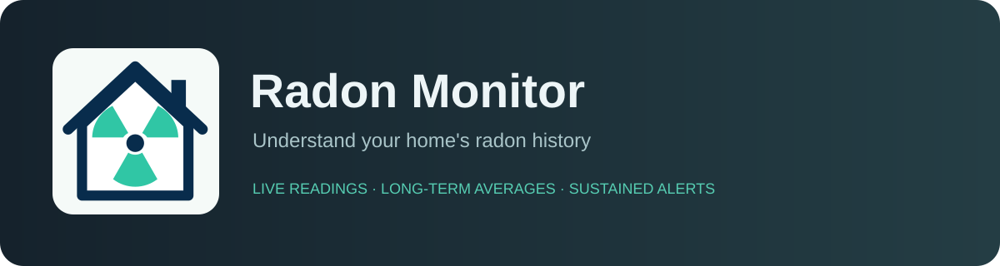
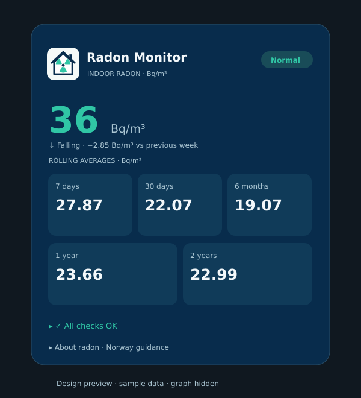

# Radon Monitor — 0.2.3 experimental



A UI-configured Home Assistant integration that monitors an existing radon sensor.
Built for `sensor.view_plus_radon`, without needing Airthings credentials or editing YAML.
Supports Bq/m³, Bq/m3 and pCi/L (converted to Bq/m³).

**This is a first test version. Calculation and alert logic have automated tests; installation, config flows, Recorder queries and notifications still require testing in a real Home Assistant instance.** It has not been accepted into the public HACS catalogue. GitHub validation workflows must pass before a release is recommended.

## Features

- Current concentration and immediate Normal / Watch / Elevated / High / Sensor problem status.
- Rolling 7-day, 30-day, 6-calendar-month, 1-calendar-year and 2-calendar-year averages.
- Partial-data flags, recorded hours and hourly bucket coverage for every average.
- Sustained elevated/high alert indicators and advisory notifications.
- Recovery hysteresis and unavailable/stale-source notifications.
- One device per source; multiple sources are supported.
- Settings and notification destination editable through Configure.

## Install through HACS

1. HACS → three-dot menu → Custom repositories.
2. Add `https://github.com/Teeseeone/radon-monitor`, type **Integration**.
3. Find **Radon Monitor**, download and restart Home Assistant.
4. Settings → Devices & services → Add integration → **Radon Monitor**.
5. Select your original radon sensor and name the monitor.
6. Open **Configure** to choose thresholds, delays and notification destination.

For manual testing, copy `custom_components/radon_monitor` into `/config/custom_components/radon_monitor`, restart, then follow steps 4–6.

Requires Home Assistant 2026.9 or newer and Recorder.

## Update from 0.1.0

Download the latest version in HACS and restart Home Assistant. Radon Monitor now appears under **Settings → Devices & services → Integrations**, with its existing device and entities. Entity IDs, configuration and statistics are retained; do not delete and recreate your monitor.

## Bundled Radon Monitor card



The design preview uses sample values and hides the optional source trend. The card uses the selected original A house icon and a navy-and-mint style by default. Its visual editor also offers Dashboard theme appearance. It supports small screens. It reads integration status and sustained alerts rather than calculating separate thresholds. All readings are clickable. It never operates ventilation equipment.

After installing/updating and restarting:

1. Enable Advanced Mode in your HA user profile if Resources is hidden.
2. The integration automatically registers its card resource. Restart HA and refresh the frontend after updating. For manual fallback, use **Settings → Dashboards → three-dot menu → Resources → Add resource**.
3. URL: `/radon_monitor/radon-monitor-card.js?v=0.2.3`; type: **JavaScript module**.
4. Refresh your browser, edit a dashboard, and add **Radon Monitor** from the card picker.
5. Choose the Radon Monitor **concentration** entity in its visual editor. Optional overrides support renamed entities and multiple monitors.

The resource is served by the installed integration, so a separate HACS dashboard repository is not required. Storage-mode dashboard resources are registered automatically; existing URLs for this card are updated in place. YAML resource configuration is left untouched and the card is loaded through the frontend module API instead. Existing manual resources may remain. The frontend must be loaded after an integration entry has been set up. If using YAML dashboards, add the same URL with `type: module` to your Lovelace resources.

A complete starter card:

```yaml
type: custom:radon-monitor-card
name: Radon Monitor
entity: sensor.radon_monitor_concentration
show_graph: true
days_to_show: 7
```

The source trend uses HA's built-in statistics graph with hourly means from the original source. Average entity history starts at installation; its numeric value still uses earlier source statistics. Trend days can be set from 1 to 30 in the editor. Turn off **Show source trend** for a compact card. Coverage is hourly bucket availability. Partial history is visibly marked.

### Branding

Original A branding is shared by the integration, card and repository. Light/dark icons and high-density variants are bundled in `custom_components/radon_monitor/brand/`. Home Assistant 2026.3+ serves these locally, so an external brands submission is not needed for the HA integration tile. Refresh the frontend after updating and restarting. HACS listing/update artwork can depend on the HACS version and its own image source; a CDN-based listing may still show its placeholder.

Source: [Home Assistant local brand images](https://developers.home-assistant.io/blog/2026/02/24/brands-proxy-api/).

## Default behavior

| Setting | Default |
|---|---|
| Watch / recovery boundary | 80 Bq/m³ |
| Elevated threshold | 100 Bq/m³ |
| High threshold | 200 Bq/m³ |
| Elevated/high persistence | 2 hours |
| Recovery below 80 | 6 hours |
| Maximum source report age | 3 hours |
| Sensor problem persistence | 2 hours |
| Notifications | Home Assistant persistent notification |

Select an existing legacy `notify.mobile_app_…` action in Configure for phone notifications, or `none` to disable notifications. Notify entity-only destinations are not supported in this prototype.

Status changes immediately; sustained alert binary sensors and notifications wait for persistence. High alerts remain latched until recovery, even if the current status drops to Elevated or Watch. No repeated notifications while the same alert remains active. Missing or stale data resets concentration persistence timers. Source age uses `last_reported`, so unchanged values do not count as stale if the integration continues reporting them. Report timestamps indicate HA activity, not independently verified device sampling timestamps.

A source is stale after three hours without a report; its problem notification follows another two hours of continuous invalidity with defaults. Unavailable/unknown readings start the problem timer immediately. Changing settings or restarting HA resets persistence timers, because continuity while stopped is not known. Active alert levels are retained to avoid duplicate alerts.

## Historical data

Averages read **the original sensor's Recorder long-term statistics**, refreshed hourly. Existing statistics are used automatically. No Airthings cloud history is downloaded. Missing history cannot be recreated.

The source must have long-term statistics (normally `state_class: measurement`) and be included in Recorder. Check Developer tools → Statistics. If no statistics exist, averages remain unknown; they never substitute missing readings with zero. The concentration entity this integration creates has measurement statistics for future history graphs, but this prototype does **not** use that entity as a fallback for the original source's averages.

Hourly means are weighted by overlap with the requested window. Coverage indicates populated hourly buckets, not the number of real measurements or proof of uninterrupted sampling within each hour. Gaps are omitted; partial coverage below 99% is flagged. Averages with very little history are available but must be read together with coverage attributes. The incomplete current hour is normally absent until Recorder compiles it.

Calendar months and years are used for 6-month, 1-year and 2-year windows, including leap years. For an Airthings sensor reporting a rolling 24-hour value, these are averages of that reported value. They are for home trend monitoring and should not be presented as a certified radon measurement.

Long-term statistics survive normal Recorder history purges. Database deletion, targeted statistics deletion or loss of the database removes that history; include it in backups. Use HA's History / statistics graph UI to browse historical values. A bundled dashboard card displays concentration, all five averages, hourly coverage, alert states and an optional source statistics graph.

## Existing alternatives and scope

- [Historical Statistics](https://github.com/krissen/historical_stats) already offers UI-created historical numeric statistics over custom periods, with long-term-statistics fallback.
- [Air Quality Card](https://github.com/KadenThomp36/air-quality-card) already offers a visual editor, radon display, graphs and a radon advisory banner.
- [EcoSense Radon](https://github.com/rwestergren/hass-ecosense-radon) connects EcoSense cloud devices and exposes alert levels; it does not monitor an arbitrary Airthings source.
- [Airthings](https://www.home-assistant.io/integrations/airthings/) supplies device readings; [Airthings BLE](https://www.home-assistant.io/integrations/airthings_ble/) supports certain devices' short/long-term readings.

Radon Monitor combines selected periods, coverage metadata, sustained radon alerts and source health in one UI-configured device. The search found partial alternatives; it does not prove no equivalent project exists.

## Test it

Read [TESTING.md](TESTING.md) before installing in a production system. No ventilation equipment is controlled by this prototype.

Run pure calculation/state-machine tests locally:

```sh
python -m unittest discover -s tests -v
python -m compileall -q custom_components
```

CI also runs hassfest and HACS validation. HACS branding validation is temporarily excluded while verifying its compatibility with bundled local brand images. This repository is available as a custom repository; it has not been submitted to the public catalogue.

## Radon interpretation

Norwegian DSA guidance uses annual-average exposure. A short-term reading over 100 or 200 Bq/m³ is an advisory to examine sustained conditions, not an immediate emergency classification. See [DSA recommended limits](https://www.dsa.no/radon/anbefalte-grenser-for-radon) and [measurement procedure](https://www.dsa.no/radon/slik-maler-du-radon).

## License

MIT. Experimental, community-maintained custom integration.

## Radon guidance

Radon is an invisible, odourless radioactive gas. Long-term exposure increases lung cancer risk. Lower levels are better.

Norway's DSA recommends reducing radon when the **annual average exceeds 100 Bq/m³**, and keeping levels as low as practical and **below 200 Bq/m³**. Below 100 is below the action level, not a guarantee of zero risk. These limits apply to annual averages, not individual spikes; sustained alerts remain an early advisory.

Improved ventilation, sealing cracks and pipe penetrations towards the ground, and a radon extraction system (radonsug/radon sump) can help. The appropriate measures depend on the source. Remeasure after changes to confirm the effect.

Official sources: [DSA recommended levels](https://www.dsa.no/radon/anbefalte-grenser-for-radon), [DSA reduction measures](https://www.dsa.no/radon/tiltak-mot-radon), and [DSA measurement guidance](https://www.dsa.no/radon/slik-maler-du-radon).

The device page's **Visit** link opens this guide. Home Assistant's standard Device info box has no free-text description field. The bundled card shows a collapsed About radon section by default; disable **Show radon explanation (Norway)** in its visual editor, or set `show_info: false`. These guidance values do not change your configurable alert thresholds.
